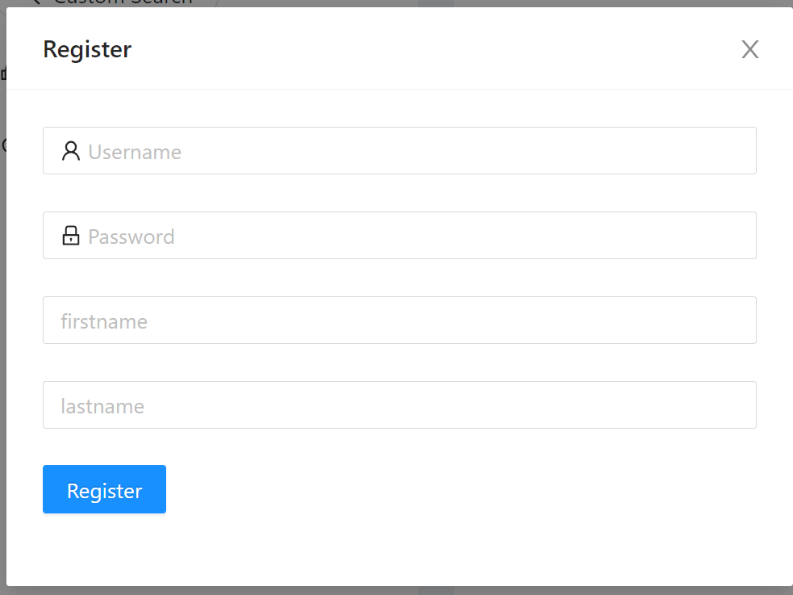

# Twitch-Social-Network

<!-- TABLE OF CONTENTS -->
<details open="open">
  <summary><h2 style="display: inline-block">Table of Contents</h2></summary>
  <ol>
    <li>
      <a href="#about-the-project">About The Project</a>
      <ul>
        <li><a href="#built-with">Built With</a></li>
      </ul>
    </li>
    <li>
      <a href="#getting-started">Getting Started</a>
      <ul>
        <li><a href="#prerequisites">Prerequisites</a></li>
        <li><a href="#installation">Installation</a></li>
      </ul>
    </li>
    <li><a href="#usage">Usage</a></li>
    <li><a href="#contact">Contact</a></li>
  </ol>
</details>


<!-- ABOUT THE PROJECT -->
## About The Project


A full-stack web application to provide users a twitch community to search and get recommendations to the twitch resources (stream, video, clip), posts and comment to the relative games or channels. 
<br/>
This repo is about the backend, To get more detail about the frontend click this link: [Twitch-Social-Network-frontend](https://github.com/ZLi0111/Twitch-Social-Network-frontend)
<br/>
Here is a the [demo link](http://18.144.22.235/) 

### Built With

* [Spring](https://spring.io/)
* [MySQL](https://www.mysql.com/)
* [Redis](https://redis.com/)


<!-- GETTING STARTED -->
## Getting Started

To get a local copy up and running follow these simple steps.

### Prerequisites

This is a list of things you need to use the software and how to install them.
* Java 8 or higher
* maven
* spring

### Installation

1. Install the Intellij IDEA Ultimate
2. Get a free API from: [twitch api](https://dev.twitch.tv/)
3. Download Apache Tomcat 9: 
   [Apache Tomcat 9 download page](https://tomcat.apache.org/download-90.cgi)
4. Clone this project open it in  Intellij
   ```sh
   git clone https://github.com/zli0111/Twitch-Social-Network.git
   ```
5. Install the packages
   


<!-- USAGE EXAMPLES -->
## Usage

To use this website you need create an account first, and then login.


for the user that visite this website first time, the recommendation will recommend you the top game from the twitch api, you can click the star button to favorite it, once you get your favorite list, the recommendation list will update based on your favorite items.


<!-- CONTACT -->
## Contact

Zhengrong Li - email: Zhengrongli1003@gmail.com

Project Link: [https://github.com/zli0111/twitch_social_network](https://github.com/zli0111/twitch_social_network)

Personal website: [zli0111](http://zli0111.com)

Linkedin: [in/zli0111/](https://www.linkedin.com/in/zli0111/)

